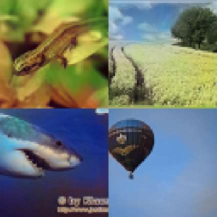

# Evaluation of Image Colourization Approaches

### Abstract

> This paper delves into the modern ways of adding colour to monochrome - black-and-white - images, through the use of deep learning. We take inspiration from previous works to implement a U-Net architecture that attempts to colourize 64x64 images taken from the Imagenet dataset. The network is used to implement two different methods of colourization, one through regression and the other through classification. The training was done on a dataset of 50000 images for the regression, and 30000 for classification. The results indicate successful colourizations using both methods with the U-net architecture. The way of classification shows more vibrant colours than regression, but also assesses bolder colours which can lead to strange results. Improvements to the results could possibly be achieved through a variety of adjustments, such as a larger dataset, a more advanced network as well as training the network training.

## Deep Learning Image Colorization

> This project aimed to replicate results of previous papers while performing additional evaluations of colorization techniques.

We applied state of the art image colorization techniques and compared them with more classic deep learning approaches based on regression.

  

### Frameworks and Tools
